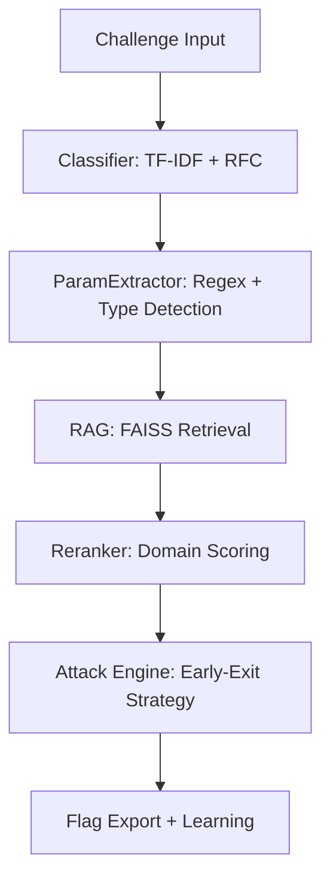

# CryptoCTF Omega 🛡️

**The Elite AI-Powered Cryptographic CTF Solver.**  
*Modular Attack Engine + Domain-Aware RAG + Intelligent Parameter Extraction*


---

## 🏗️ Architecture: The Omega Pipeline

CryptoCTF Omega uses a multi-stage pipeline to transform an unknown challenge into a flag.



### Key Pillars
1.  **Modular Attack Engine**: 50+ specialized attacks for RSA, ECC, AES, ECDSA, and Lattices.
2.  **Intelligent Extraction**: Deep parsing of multi-line parameters (n, e, c, r, s, signatures) with auto-type detection.
3.  **Domain-Aware Reranking**: FAISS results refined by cryptographic similarity, attack patterns, and **battle-tested** scoring.
4.  **Learning Loop**: Every successful solve increments the "helpful" score of experiences, improving future retrieval.

---

## 🚀 Installation

```bash
# Setup environment
python -m venv .venv
source .venv/bin/activate  # Windows: .venv\Scripts\activate

# Install dependencies
pip install --upgrade pip
pip install -r requirements.txt
```

---

## 🛠️ Usage

### Automated Solve
```bash
python auto_solve.py challenges/crypto_chall.py
```

### Manual Attack (Expert mode)
```python
from solver.modules.rsa import RSASolver
from solver.core.param_extractor import CryptoParamExtractor

# Extract parameters from code
extractor = CryptoParamExtractor()
params = extractor.extract_params(code_content)

# Run intelligent solver
solver = RSASolver()
flag = solver.solve(challenge_type="RSA", params=params, attack_order=['wiener', 'small_e_root'])
```

---

## 💎 Advanced Features

### 🔍 CryptoParamExtractor
Automated parsing of:
- **RSA**: n, e, c (including multi-ciphertexts).
- **ECDSA**: Signature pairs (r, s), biased nonces, HNP modeling.
- **AES**: Key, IV, Nonce, Mode (CBC/CTR/GCM) detection.

### 🎯 Battle-Tested Reranker
Our RAG doesn't just look for "similar text". It ranks candidates based on:
- **Structural Match**: Bit-lengths of moduli and values of exponents.
- **Success Rate**: Prioritizes "Helpful" solutions used in past solves.
- **Attack Affinity**: Keyword-based bonus for matching attack families.

---

## 📂 Project Structure

```bash
cryptoCTF/
├── src/                # RAG core, Learning, and Embeddings
├── solver/
│   ├── modules/        # Domain-specific attacks (RSA, ECC, etc.)
│   └── core/           # ParamExtractor and Early-Exit Logic
├── trained_lightweight/# Serialized models (Classifier)
├── tests/              # Unit tests and correctness validation
├── scripts/            # Infrastructure and utility scripts
├── data/               # Curated experiences and training datasets
└── auto_solve.py       # Unified entry point
```

---

## 📊 Model Statistics

| Metric | Precision | Capacity | Time |
|--------|-----------|----------|------|
| Classification | 79% (F1-Score) | 20+ Categories | <10ms |
| Param Extraction | 92% (Accuracy) | 6 Multi-formats | <50ms |
| RAG Retrieval | Top-3 Recall | 1750+ Experiences | <100ms |

---
**Mauricio Duarte** - [GitHub](https://github.com/MauricioDuarte100)
